<div align="center">

# REMOCO

### Remote Workforce Management & Collaboration Platform

A multi-tenant team collaboration platform with role-based dashboards, real-time chat,
peer-to-peer video calling, and checkpoint-based task tracking — delivered through a
server-rendered **web client** and a native **Flutter mobile client** over a shared,
token-authenticated REST API.


</div>

---

## Overview

REMOCO is a platform for distributed teams, reachable two ways: a server-rendered **web
app** and a native **Flutter mobile app**, both backed by the same MySQL database. The web
app renders its own pages in PHP; the mobile app talks to a token-authenticated **REST API**
(`public/api/`) that returns JSON. A company registers, receives a unique company ID, and
then onboards employees under one of three roles. Each role gets a purpose-built dashboard
exposing only the capabilities that role needs.

The interesting part of the domain is the **task delegation chain**. A Project Manager
creates a task and assigns it to a Team Lead. The Team Lead breaks it into named
*checkpoints* and assigns up to three Team Members. Team Members tick off checkpoints as
they work, and when the final checkpoint closes, the parent task transitions to
`Completed` automatically and stamps its own completion date. Progress therefore rolls up
from the bottom rather than being manually reported downward.

Each task also gets a dedicated chat room — backed by Firebase Realtime Database for
messaging and Agora for video calls — so discussion stays attached to the work item
instead of living in a separate tool.

**Why this project:** it was built to practise designing a complete multi-tenant
application end to end — data modelling, role-based authorization, third-party service
integration, and real-time communication — without a framework doing the work.

---

## Features

### Company / Admin
- Self-service company registration with NTN and sector metadata
- Employee onboarding with role assignment
- Employee directory with inline role reassignment and removal
- Company-wide task overview, scoped to that company's own data

### Project Manager
- Task statistics dashboard (total / not started / in progress / completed / high priority)
- Create tasks with title, description, due date, and priority
- Delegate tasks to Team Leads
- Change task priority and status, or delete tasks
- Per-task chat with file sharing and video calling

### Team Lead
- Dashboard of assigned workload
- Decompose a task into named checkpoints
- Assign up to three Team Members per task
- Track checkpoint completion across the team

### Team Member
- Personal task list and assigned-task views
- Tick off checkpoints to report progress
- Automatic task completion when the last checkpoint closes
- Per-task chat with file sharing and video calling

### Reporting — every role
- Company-wide analytics: status and priority distribution, completion rate, overdue count,
  workforce composition, and delivery broken down by Team Lead
- An alerts view surfacing overdue work, work due within an adjustable horizon, unstarted
  high-priority work, and tasks with nobody assigned
- Per-role reports covering the same ground at the scope that role can see, plus checkpoint
  progress and member workload

### Mobile client (Flutter)
- Native app covering the same four roles as the web client — Company/Admin, Project Manager,
  Team Lead, Team Member
- Talks to a dedicated REST API (`public/api/`) that returns JSON
- Bearer-token authentication issued at login and attached to every request through a single
  HTTP wrapper; the server scopes each query to the token's identity, company, and role
- Real-time chat (Firebase) and video calls (Agora) from the device

### Cross-cutting
- Multi-tenant data isolation by company ID, enforced in every task query and mutation
- Password hashing with `password_hash()` / bcrypt
- CSRF protection on every authenticated state-changing web request; stateless bearer tokens
  on the mobile API
- Session hardening: `HttpOnly` / `SameSite` / `Secure` cookies and id regeneration at login
- Real-time messaging (Firebase Realtime Database)
- Peer-to-peer video calls (Agora RTC)
- File sharing with extension allowlist, size cap, filename sanitisation, and chat-membership
  checks
- Pagination on every task list

---

## Screenshots

### Landing & Authentication

| Landing page | Employee login | Company login |
|---|---|---|
| 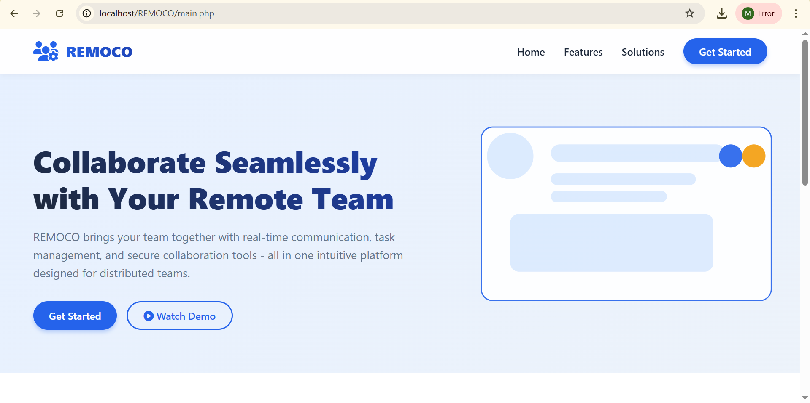 | 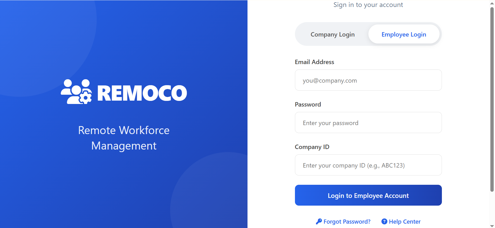 | 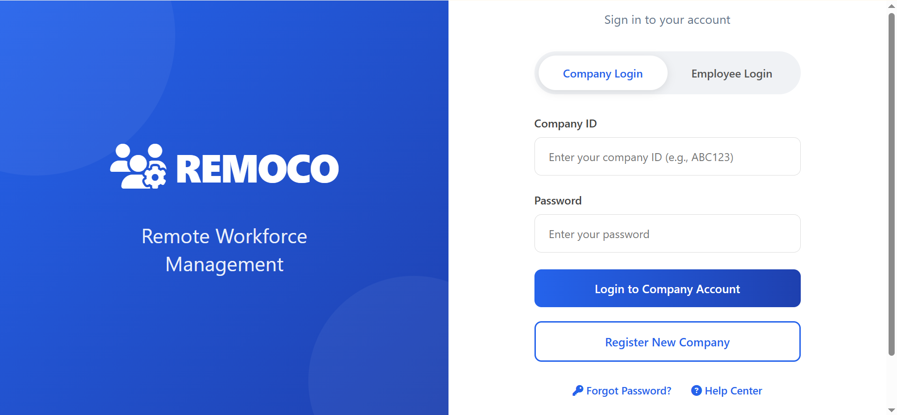 |

### Company / Admin

| Admin dashboard | Employee registration | Company-wide tasks |
|---|---|---|
| 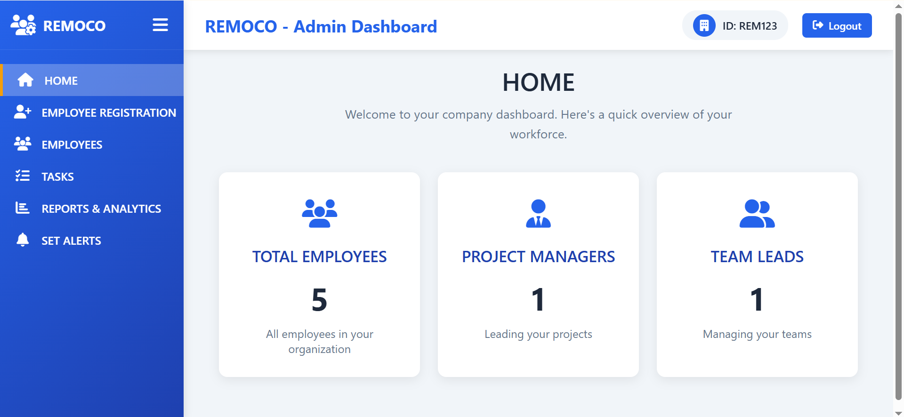 | 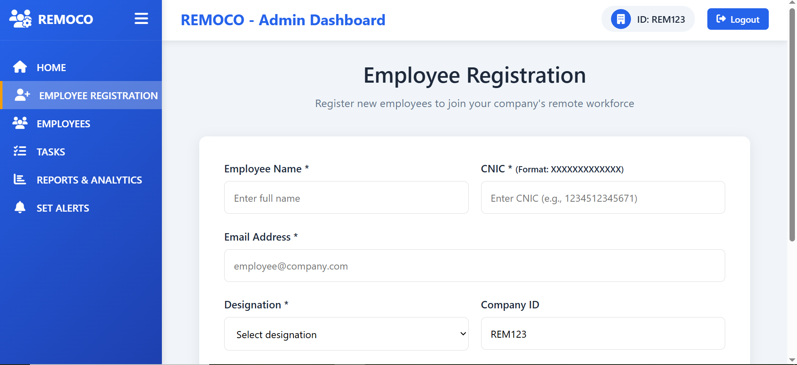 | 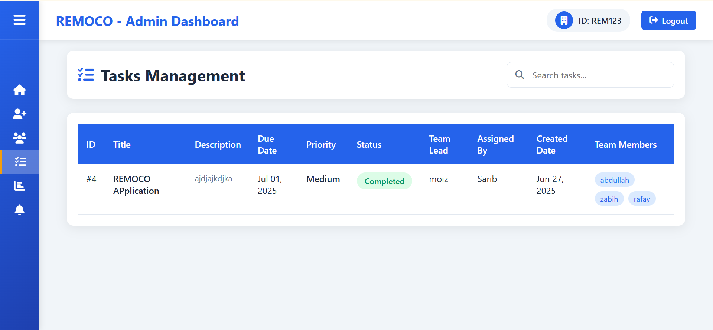 |

### Project Manager

| Dashboard | Create task | Task management |
|---|---|---|
| 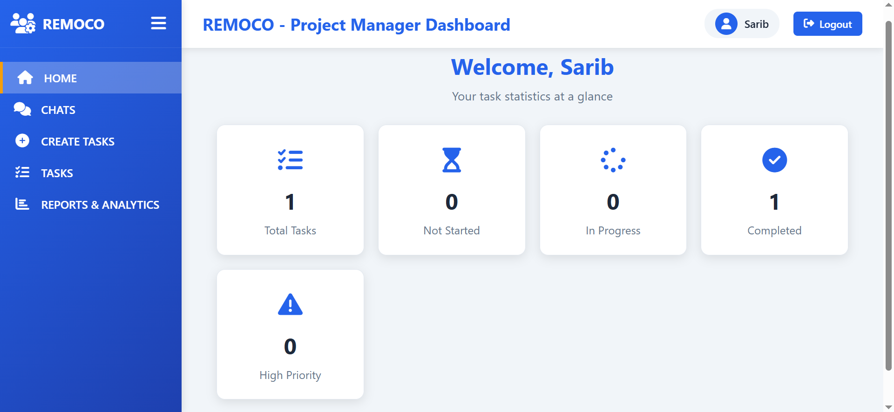 | 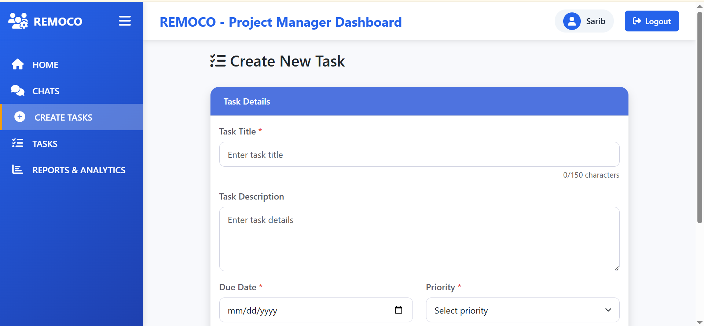 | 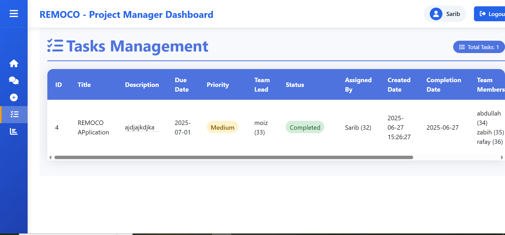 |

### Team Lead

| Dashboard | Assign task & members | Define checkpoints |
|---|---|---|
| 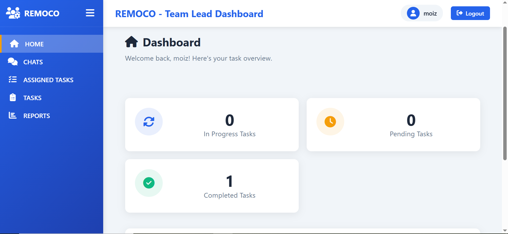 | 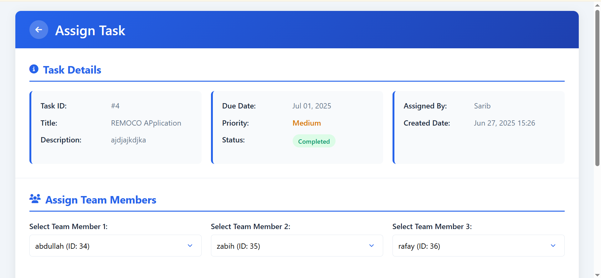 | 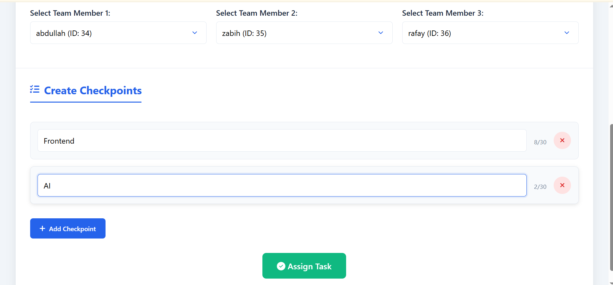 |

### Team Member

| Dashboard | Assigned tasks | Update checkpoints |
|---|---|---|
| 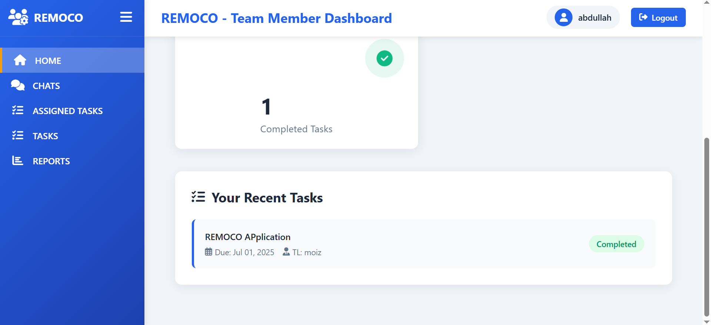 | 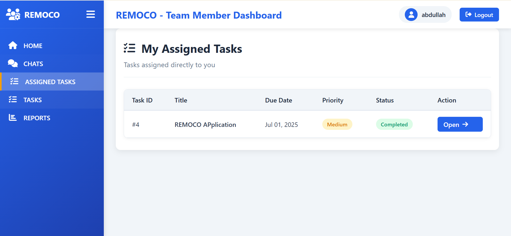 | 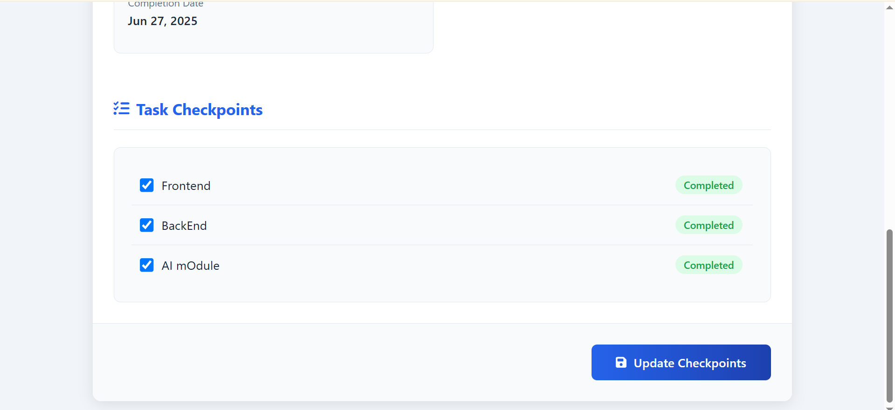 |

### Collaboration

| Task chat | Chat with file sharing |
|---|---|
| 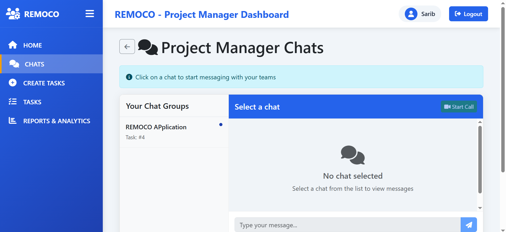 | 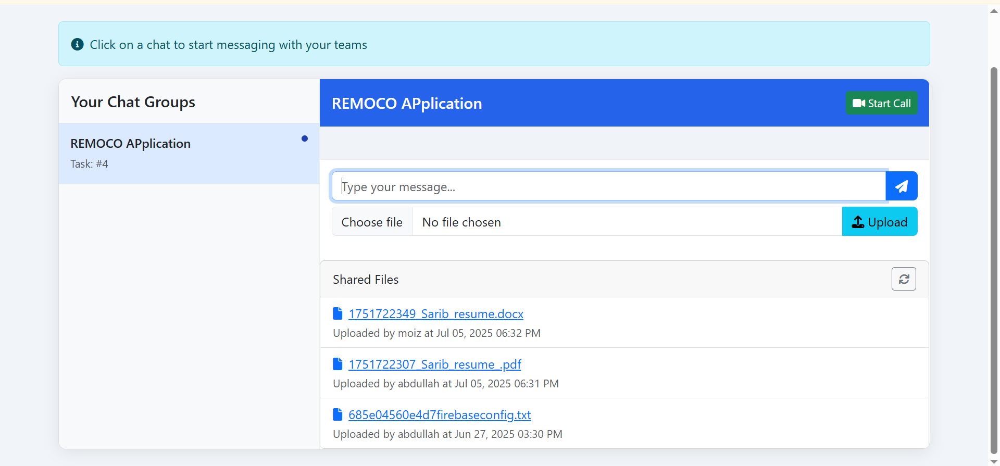 |

> The full screenshot set, including additional views, is catalogued in
> [docs/screenshots/README.md](docs/screenshots/README.md).

---

## Architecture

Two clients — a server-rendered web app and a native Flutter app — sit over one PHP backend
and one MySQL database. The web app renders its own pages and holds a session; the mobile app
talks to a token-authenticated REST API that returns JSON.

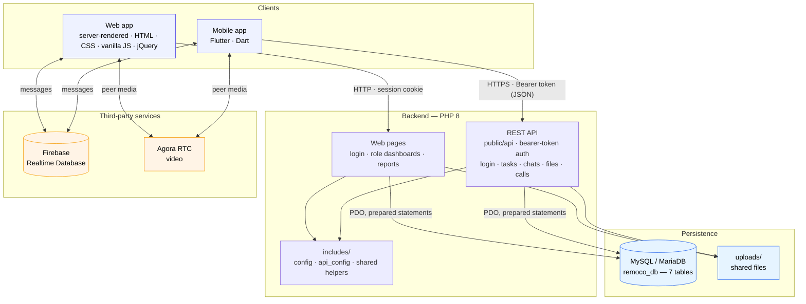

**Web request lifecycle.** Every page is a self-contained PHP script. It requires
`session_bootstrap.php` (which applies the cookie flags, starts the session, and exposes the
CSRF helpers), enforces its own role guard, loads `includes/config.php`, opens a database
connection, runs its queries, and renders HTML. There is no front controller and no router —
navigation is direct links plus a `?page=` query parameter on the dashboards, which the
shells resolve against an allow-list derived from their own sidebar. Cross-cutting concerns
live in shared includes under `includes/` — session handling, configuration, pagination, and
report presentation each have one home.

**API request lifecycle.** Each mobile endpoint requires `_bootstrap.php`, which loads
`includes/api_config.php`, opens the database, and exposes the auth helpers. A login endpoint
mints a stateless, HMAC-signed bearer token; every other endpoint calls `require_auth()`,
decodes the token, and scopes each query to the caller's identity, company, and role — so the
mobile client is held to the same tenant and role boundaries as the web client.

### Data model

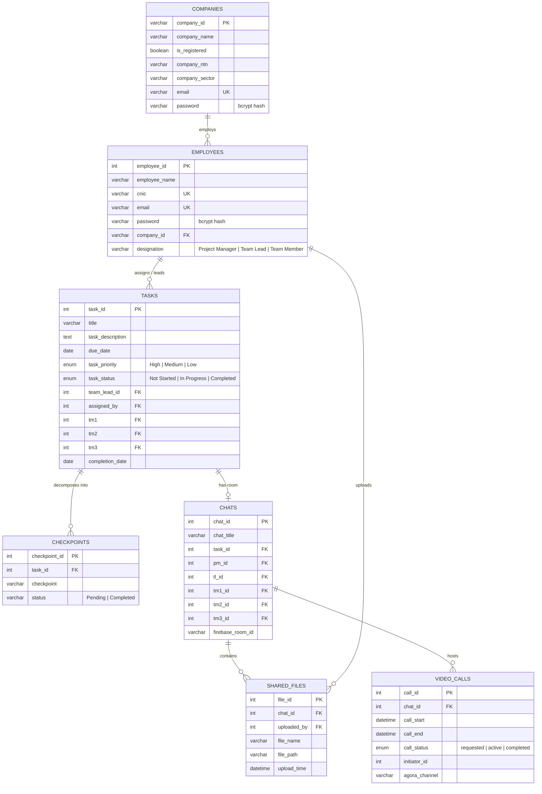

Reference diagrams produced during design:
[architecture](docs/screenshots/architecture-diagram.png) ·
[use cases](docs/screenshots/use-case-diagram.png) ·
[ER diagram](docs/screenshots/database-erd.png)

---

## Technology Stack

| Layer | Technology | Notes |
|---|---|---|
| Web language | PHP 8.2 | No framework; procedural, one script per page |
| Mobile client | Flutter (Dart) | Native app over the REST API in `public/api/` |
| Database | MySQL / MariaDB | 7 tables, InnoDB, foreign-key constrained |
| DB access | PDO + mysqli | Prepared statements throughout |
| Web frontend | HTML5, CSS3, vanilla JS | Inline `<style>` per page; CSS custom properties for theming |
| DOM/AJAX helper | jQuery 3.6 | Chat pages only |
| Real-time messaging | Firebase Realtime Database | Web (compat SDK via CDN) and mobile (`firebase_database`) |
| Video calling | Agora RTC | Web SDK 4.19 via CDN; mobile `agora_rtc_engine` |
| Icons | Font Awesome 6.4 | CDN |
| Web auth | PHP sessions + `password_hash()` | bcrypt via `PASSWORD_DEFAULT` |
| API auth | Signed bearer token + `password_hash()` | Stateless HMAC-signed token; no third-party library |
| Local runtime | XAMPP (Apache + MySQL) | Also runs under `php -S` |

**No build step for the backend.** No bundler, transpiler, or Composer package — clone,
configure, and serve. The Flutter client uses the standard Dart toolchain (`flutter pub get`).

---

## Installation

### Prerequisites

- PHP **8.0+** with `pdo_mysql` and `mysqli` enabled
- MySQL **5.7+** or MariaDB **10.4+**
- Apache (XAMPP/WAMP/LAMP) — or PHP's built-in server for a quick look

### Steps

**1. Clone the repository**

```bash
git clone https://github.com/rao-sarib/remoco.git
cd remoco
```

**2. Create your configuration file**

```bash
cp includes/config.example.php includes/config.php
```

Edit `includes/config.php` and set your database credentials. It is git-ignored, and it lives
outside `public/` so it is never reachable over HTTP.

**3. Point the document root at `public/`**

Everything web-facing lives in `public/`; `includes/` must stay outside it.

```apache
# Apache — httpd.conf or a vhost
DocumentRoot "/path/to/remoco/public"
<Directory "/path/to/remoco/public">
    AllowOverride None
    Require all granted
</Directory>
```

**4. Start MySQL, then open the application**

```
http://localhost/
```

The landing page is also the schema installer — on first load it creates the `remoco_db`
database and all seven tables if they do not already exist. There is no SQL dump to import.

**5. Register a company, then log in**

Click **Get Started** → **Register New Company**. Company IDs must match `AAA111` (three
uppercase letters followed by three digits). Log in as the company, register employees under
each role, then log in as those employees.

### Quick look without Apache

PHP's built-in server can serve `public/` directly:

```bash
php -S localhost:8000 -t public
# then open http://localhost:8000
```

### Mobile client

The Flutter app lives in [`mobile/`](mobile) and talks to the REST API in `public/api/`. It
needs the Dart toolchain plus its own configuration:

```bash
cd mobile
flutter pub get

# Firebase config is git-ignored — copy the templates and fill in your project, or run
# `flutterfire configure`
cp lib/firebase_options.dart.example lib/firebase_options.dart
cp android/app/google-services.example.json android/app/google-services.json

# point the app at your API host (e.g. 10.0.2.2 for an Android emulator)
#   edit lib/services/api_constants.dart

flutter run
```

The API needs its own config file (see below). Full detail is in
[mobile/README.md](mobile/README.md).

---

## Configuration

The **web app** reads `includes/config.php`; the **mobile API** reads
`includes/api_config.php`. Both are created from committed `*.example.php` templates, both are
git-ignored, and both live outside `public/` so they are never reachable over HTTP. Nothing
else in the codebase contains credentials.

**Web** — `includes/config.php` (from `config.example.php`)

| Setting | Purpose |
|---|---|
| `$host`, `$username`, `$password`, `$dbname` | MySQL connection |
| `FIREBASE_*` | Firebase Realtime Database — powers chat |
| `FIREBASE_DATABASE_URL` | Default (global) RTDB endpoint, used by dashboards |
| `FIREBASE_DATABASE_URL_REGIONAL` | Regional RTDB endpoint, used by chat pages |
| `AGORA_APP_ID`, `AGORA_TOKEN` | Agora RTC credentials for video calls |

**Mobile API** — `includes/api_config.php` (from `api_config.example.php`)

| Setting | Purpose |
|---|---|
| `$host`, `$username`, `$password`, `$dbname` | MySQL connection |
| `API_TOKEN_SECRET` | Signs the bearer tokens the login endpoints issue — keep secret |
| `API_TOKEN_TTL` | How long an issued token stays valid (seconds) |
| `API_ALLOWED_ORIGIN` | Optional CORS origin (never `*`) |
| `AGORA_APP_ID` | Agora App ID returned to the client for video calls |

Every value may also be supplied as a real environment variable, which takes precedence
over the file. See [.env.example](.env.example) for the web variable names.

### Firebase & Agora

Chat and video calling use your own Firebase and Agora projects. The Firebase web
configuration is supplied through `includes/config.php` and injected into the client, with access to
the Realtime Database governed by your project's **Security Rules**. Agora credentials are
configured the same way.

Everything else — authentication, task management, reporting, file sharing — runs with only a
database configured.

---

## Project Structure

```
.
├── public/                     # Document root — everything web-facing
│   ├── index.php               #   front door, serves the landing page
│   ├── main.php                #   landing page + schema installer
│   ├── login.php  logout.php   #   authentication
│   │
│   ├── admin_dashboard.php     # Company/Admin ────────────────────────────
│   ├── home.php                #   workforce overview
│   ├── employee_registration.php   onboard employees
│   ├── employees.php           #   employee directory
│   ├── tasks.php               #   company-wide task list
│   ├── reports_analytics.php   #   company-wide analytics
│   ├── set_alerts.php          #   at-risk work
│   │
│   ├── pm_dashboard.php        # Project Manager ─────────────────────────
│   ├── pm_home.php             #   task statistics
│   ├── pm_createtasks.php      #   create & delegate
│   ├── pm_tasks.php            #   manage own tasks
│   ├── pm_chats.php            #   task chat + video
│   ├── pm_reports.php          #   manager reporting
│   │
│   ├── tl_dashboard.php        # Team Lead ────────────────────────────────
│   ├── tl_home.php             #   workload overview
│   ├── tl_assign.php           #   assign members, define checkpoints
│   ├── tl_assigned_tasks.php   #   tasks assigned to this lead
│   ├── tl_tasks.php            #   all related tasks
│   ├── tl_chats.php            #   task chat + video
│   ├── tl_reports.php          #   lead reporting
│   │
│   ├── tm_dashboard.php        # Team Member ──────────────────────────────
│   ├── tm_home.php             #   personal overview
│   ├── tm_assigned_tasks.php   #   directly assigned tasks
│   ├── tm_tasks.php            #   all tasks
│   ├── tm_updatetask.php       #   tick off checkpoints
│   ├── tm_chats.php            #   task chat + video
│   ├── tm_reports.php          #   member reporting
│   │
│   ├── file_upload.php         # JSON endpoints ───────────────────────────
│   ├── get_files.php           #   chat file listing
│   ├── video_call.php          #   initiate Agora session
│   │
│   ├── api/                    # Mobile REST API — token-authenticated ─────
│   │   ├── _bootstrap.php      #   config, PDO, bearer-token auth, guards
│   │   ├── company_login.php   #   login endpoints issue a signed token
│   │   ├── employee_login.php  #
│   │   ├── get_*.php  create_task.php  assign_task.php  …   role-scoped
│   │   └── uploads/            #   API file storage (contents git-ignored)
│   │
│   └── uploads/                # Web runtime file storage (contents git-ignored)
│
├── mobile/                     # Flutter mobile client ─────────────────────
│   ├── lib/                    #   Dart source (screens, dashboards, services)
│   │   └── services/
│   │       └── api_http.dart   #   authenticated HTTP wrapper (bearer token)
│   ├── android/ ios/ web/ …    #   platform shells
│   ├── pubspec.yaml            #   dependencies
│   └── .gitignore              #   excludes build artifacts & Firebase config
│
├── includes/                   # Outside the document root — not web-reachable
│   ├── config.example.php      #   web configuration template (committed)
│   ├── config.php              #   web configuration (git-ignored)
│   ├── api_config.example.php  #   API configuration template (committed)
│   ├── api_config.php          #   API configuration + token secret (git-ignored)
│   ├── session_bootstrap.php   #   cookie hardening, session start, CSRF helpers
│   ├── db_connect.php          #   shared mysqli connection + chat-membership guard
│   ├── pagination.php          #   shared offset pagination for the list views
│   └── report_styles.php       #   shared presentation for the report panels
│
├── docs/
│   ├── ROADMAP.md              # Architecture & planned work
│   └── screenshots/            # Catalogued UI captures & design diagrams
│
├── README.md  NOTICE.md  RELEASE_NOTES.md
└── .gitignore  .gitattributes  .env.example
```

Configuration and shared code sit in `includes/`, outside the document root, so they cannot
be requested over HTTP. Page filenames are prefixed by role — `pm_`, `tl_`, `tm_` — which
makes the authorization boundary visible from the directory listing.

---

## Design Notes

A few decisions worth calling out, because they shaped the rest of the code.

**No framework, by choice.** Every page is a self-contained PHP script — session, role guard,
configuration, queries, HTML. There is no routing layer, no templating engine, and no build
step. The point was to write the parts a framework normally provides and understand what they
cost. Cross-cutting concerns live in four shared includes rather than a middleware stack.

**Authorization is visible in the filenames.** Pages are prefixed `pm_`, `tl_`, `tm_`, and
each enforces its own guard before any side effect. Task mutations carry an ownership
predicate in the SQL statement itself, so a query cannot be reached without also being scoped.

**Progress is derived, not reported.** Checkpoint state is the source of truth for task
status, recomputed on every update in both directions. A task cannot claim to be complete
while its checkpoints say otherwise.

**Tenancy is resolved through participation.** `tasks` has no `company_id` of its own — a task
belongs to a company through the employees attached to it. Normalised, but it makes every
tenant-scoped query a join; storing it directly is on the roadmap.

**Assignment slots are explicit.** A task carries `tm1`/`tm2`/`tm3`, and the matching chat
room mirrors them, so the working group for a task is a single row rather than a join.

**Two clients, one model.** The web app renders pages server-side; the Flutter app consumes a
JSON REST API (`public/api/`). The API authenticates with a stateless, HMAC-signed bearer
token minted at login — no session cookies, no third-party JWT library. Every endpoint derives
the caller's identity, company, and role from that token and scopes each query to it, so the
mobile client is held to the same tenant and role boundaries as the web client. The mobile app
attaches the token through one HTTP wrapper (`mobile/lib/services/api_http.dart`) rather than
per call site.

Full reasoning, plus the planned work in priority order, is in
[docs/ROADMAP.md](docs/ROADMAP.md).

---

## Roadmap

Highest value first:

1. **Commit the verification suite** — an authorization matrix across every
   (role × page × target-owner) combination, runnable against a throwaway database.
2. **Extract a shared layout and data-access layer** — the four dashboards share most of
   their shell and the three chat pages differ by one role string.
3. **Move inline CSS into cacheable stylesheets** — currently re-sent on every request.
4. **Replace fixed assignment slots with a join table** — arbitrary team sizes.
5. **Store `company_id` on `tasks`** — make tenancy explicit in the schema.
6. **Serve uploads through an authorising handler** from outside the document root.
7. **Mint Agora tokens server-side** per user and channel.
8. **Standardise on PDO** behind one connection factory.
9. **Move schema creation into a migration script**, out of the request path.
10. **Login throttling and audit logging** — per-account and per-IP backoff, plus an
    authentication and authorization event trail.
11. **Notification delivery** — turn the derived alerts view into a subscription feature.

---

## Author

**Sarib**

- GitHub: [github.com/rao-sarib](https://github.com/rao-sarib)
- LinkedIn: [linkedin.com/in/rao-sarib](https://www.linkedin.com/in/rao-sarib/)
- Email: [saribrao7@gmail.com](mailto:saribrao7@gmail.com)

Designed, built, and documented solo — data model, authorization, UI, and third-party
integrations.

---

## License

**All Rights Reserved.** This repository is published as a portfolio piece to demonstrate
engineering work. It is not open source and is not licensed for reuse, modification, or
redistribution. See [NOTICE.md](NOTICE.md).
